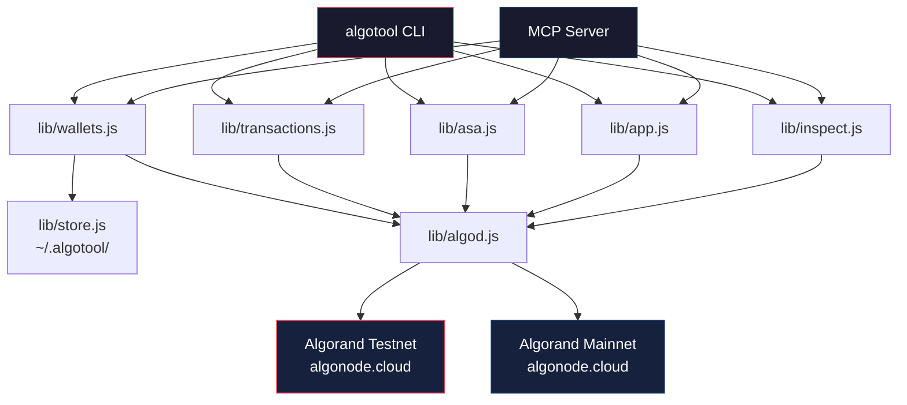
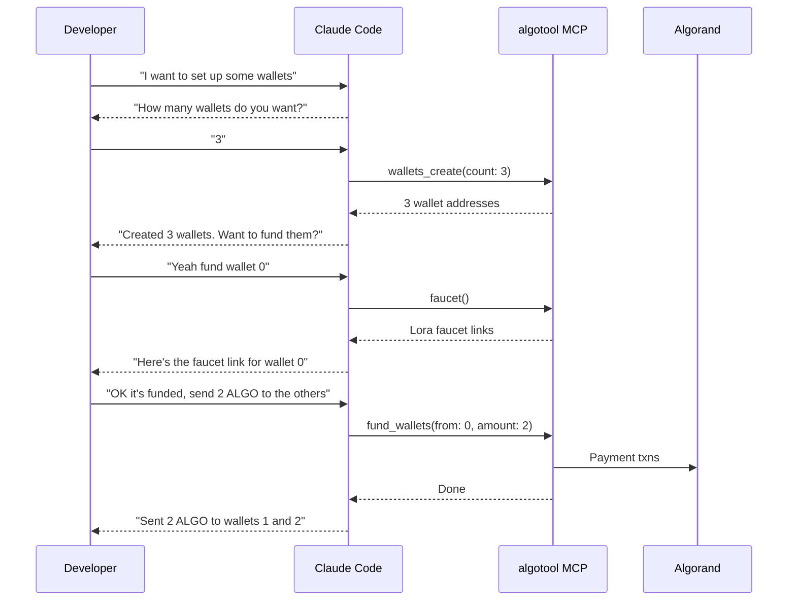

# algotool

Algorand developer toolkit — wallets, funding, batch transactions, ASA management, contract interactions, and transaction inspection. Built for testnet developers.

Works as a **CLI** and as a **Claude Code MCP server**, so Claude can manage Algorand wallets and transactions directly in your terminal.

**You're in control.** algotool never does anything automatically — you decide how many wallets to create, which ones to fund, where to send, what to inspect. Every action is explicit.

## Install

```bash
git clone https://github.com/mitchhall/algotool.git
cd algotool
npm install
```

Or link globally:

```bash
npm link
```

## Quick Start

```bash
# 1. Create however many wallets you need
algotool wallets create 3

# 2. Get faucet links for your wallets (fund whichever ones you want)
algotool faucet

# 3. Check balances
algotool status

# 4. Distribute funds from one wallet to the others (optional)
algotool fund 0 2

# 5. Do whatever you want from here
algotool send 0 SOMEADDRESS... 1.5       # send ALGO
algotool asa create 0 "My Token" TKN 1M  # create a token
algotool tx TXID...                       # inspect a transaction
algotool app state 12345                  # read a contract
```

## Architecture



## CLI Reference

### Wallets

| Command | Description |
|---|---|
| `wallets create <N>` | Generate N wallets |
| `wallets list` | Show wallets with balances |
| `wallets export` | Show wallets with mnemonics |
| `wallets import <mnemonic>` | Import wallet from 25-word mnemonic |
| `wallets clear` | Delete all wallets |

### Funding

| Command | Description |
|---|---|
| `faucet` | Shows clickable Lora faucet links for each wallet |
| `fund <from> <amount>` | Send ALGO from wallet to all others |
| `send <from> <to-address> <amount>` | Send ALGO to any address |
| `batch <address> <amount>` | All wallets send to one address |

### ASA (Tokens)

| Command | Description |
|---|---|
| `asa create <wallet> <name> <unit> <total> [decimals]` | Create a new ASA |
| `asa optin <wallet> <asset-id>` | Opt into an ASA |
| `asa send <wallet> <to> <asset-id> <amount>` | Transfer tokens |
| `asa info <asset-id>` | Show ASA details |
| `asa list <wallet>` | Show holdings for a wallet |

### Smart Contracts

| Command | Description |
|---|---|
| `app call <wallet> <app-id> [method] [args...]` | Call a contract method |
| `app state <app-id>` | Read global state |
| `app address <app-id>` | Get app escrow address |

### Inspect

| Command | Description |
|---|---|
| `tx <txid>` | Inspect a transaction |
| `group <txid>` | Inspect an atomic group |
| `history <address\|index> [limit]` | Recent transactions |

### Config

| Command | Description |
|---|---|
| `network [testnet\|mainnet]` | Show or set network |
| `status` | Balance overview |

## MCP Server (Claude Code Integration)

The MCP server lets Claude Code use algotool as a set of tools. Claude will always ask you before taking any action — how many wallets, which one to send from, how much, etc.

### Setup

```bash
claude mcp add --transport stdio algotool -- node /path/to/algotool/bin/mcp-server.js
```

### How it works



### Available MCP Tools (22)

**Wallets:** `wallets_create`, `wallets_list`, `wallets_export`, `wallets_import`, `wallets_clear`

**Funding:** `faucet`, `send_algo`, `fund_wallets`, `batch_send`

**ASA:** `asa_create`, `asa_optin`, `asa_send`, `asa_info`, `asa_list`

**Smart Contracts:** `app_call`, `app_state`, `app_address`

**Inspect:** `inspect_transaction`, `inspect_group`, `account_history`, `get_balance`

**Config:** `set_network`, `get_network`

## Storage

All data lives in `~/.algotool/`:

```
~/.algotool/
├── wallets.json    # Wallet addresses + encrypted mnemonics
└── config.json     # Network selection (testnet/mainnet)
```

## API

Uses [Nodely](https://nodely.io) (formerly Algonode) free-tier public endpoints:

- **Algod:** `testnet-api.algonode.cloud` / `mainnet-api.algonode.cloud`
- **Indexer:** `testnet-idx.algonode.cloud` / `mainnet-idx.algonode.cloud`
- **Faucet:** No programmatic faucet — use [Lora](https://lora.algokit.io/testnet/fund) manually
- **Limits:** ~6M requests/month, 60 req/s per IP

## Requirements

- Node.js 18+
- `algosdk` v3
- `@modelcontextprotocol/sdk` (for MCP server)

## License

MIT
